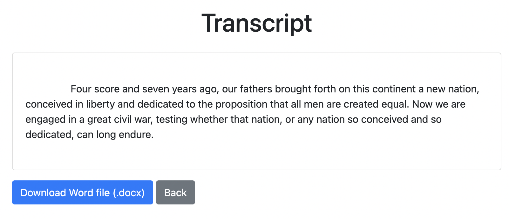

# SimpleTranscriberWebApp

A simple Flask web application to transcribe audio files to text using OpenAI's Whisper model.




## Features

- Optimize for speed or precision by choosing the model size (`tiny`, `base`, `small`, `medium`, `large`)
- Support for multiple audio or video formats (`flac`, `m4a`, `mp3`, `mp4`, `mpeg`, `mpga`, `oga`, `ogg`, `wav`, `webm`)
- Option to download transcribed text in various formats: (`.txt`, `.docx`, `.pdf`, `.html`, `.json`)
- Automatic language detection for transcription. Other Languages can be prespecified for faster transcription

### Installation

Clone the repository and install the requirements:

```bash
git clone https://github.com/henningheyen/SimpleTranscriberWebApp.git
cd SimpleTranscriberWebApp
pip install -r requirements.txt
```

## Getting Started

Once you have all require packages installed the app can be lauched with

```bash
python app.py
```

Then vist `http://127.0.0.1:5000` in your Browser.

Make sure your audio files are placed in the `uploads` folder. Your transcripted files will be located in the `transcripts` folder or can be downloaded from the WebApp directly. You can find some example audio files and its transcripts in this repository. 